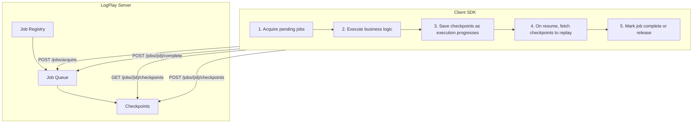
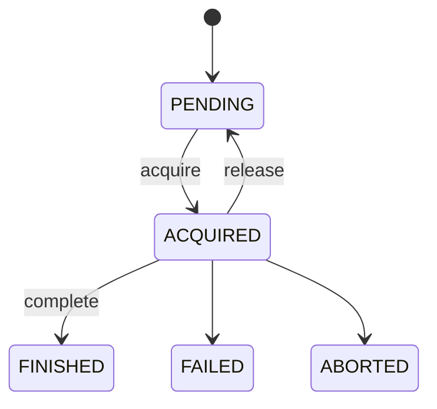

# LogPlay Server

LogPlay is a **durable execution platform**. It lets you write long-running, fault-tolerant workflows in plain code — the platform ensures they run to completion even across process restarts, network failures, or arbitrary delays.

---

## How it works

LogPlay separates *orchestration* (the server) from *execution* (the client SDK):



### Server responsibilities

- Stores and manages jobs and their checkpoints
- Exposes a versioned HTTP API (`/api/v1/...`) that the client SDK calls
- Owns the job status state machine
- Enforces checkpoint ordering via linked-chain validation

### Client SDK responsibilities

- Acquires `PENDING` jobs from the server (atomically transitions them to `ACQUIRED`)
- Runs the business logic associated with each job type
- Saves checkpoints as execution progresses — each checkpoint carries a serialized **byte array payload** and a **class type string** so the SDK can deserialize it back into the correct type when resuming
- On resume, fetches existing checkpoints via cursor-based pagination to replay from the last saved state
- Calls the server to mark the job complete, or releases it back to `PENDING` for another worker

---

## Job lifecycle



| Status     | Meaning |
|------------|---------|
| `PENDING`  | Job is registered and waiting to be picked up by a worker |
| `ACQUIRED` | A worker has claimed the job and is actively executing it |
| `FINISHED` | Worker explicitly marked the job as complete |
| `FAILED`   | Execution failed after exhausting retries |
| `ABORTED`  | Execution was cancelled before completion |

A worker can **release** an acquired job back to `PENDING` (e.g. graceful shutdown), making it available for another worker to pick up.

---

## Checkpoints

A checkpoint is a durable snapshot of execution progress saved by the client SDK. Checkpoints form a **linked chain** — each checkpoint references its predecessor, ensuring correct ordering and preventing concurrent duplicates.

| Field | Required | Description |
|-------|----------|-------------|
| `jobId` | yes | The job this checkpoint belongs to |
| `previousCheckpointId` | no | ID of the preceding checkpoint (`null` for the first) |
| `name` | no | Optional human-readable step name (e.g. `"payment-processed"`) |
| `data` | no | Serialized payload (`ByteArray`); may be omitted for chain-marker checkpoints |
| `createdAt` | yes | When the checkpoint was saved |
| `orderKey` | yes | Monotonically increasing order within a job (server-assigned) |

If a client process dies mid-execution, the next client to pick up the job fetches the existing checkpoints via cursor-based pagination and resumes from the last saved state. Payload schema/typing is the SDK's responsibility — the server stores `data` as opaque bytes.

---

## API

All endpoints are versioned under `/api/v1`. Routes are mounted via Vert.x sub-routers, so adding `/api/v2` later requires no changes to existing v1 code.

| Method | Endpoint | Description |
|--------|----------|-------------|
| `POST` | `/api/v1/jobs` | Create a new job |
| `POST` | `/api/v1/jobs/acquire` | Acquire pending jobs (atomically sets status to `ACQUIRED`) |
| `GET` | `/api/v1/jobs/:jobId/checkpoints` | Fetch checkpoints with cursor-based pagination |
| `POST` | `/api/v1/jobs/:jobId/checkpoints` | Save a checkpoint (validates ordering chain) |
| `POST` | `/api/v1/jobs/:jobId/complete` | Mark an acquired job as `FINISHED` |
| `POST` | `/api/v1/jobs/:jobId/release` | Release an acquired job back to `PENDING` |
| `POST` | `/api/v1/jobs/:jobId/error` | Report an execution error (increments retries, may transition to `FAILED`) |
| `POST` | `/api/v1/jobs/:jobId/abort` | Abort a job (transitions to `ABORTED`) |
| `POST` | `/api/v1/workers` | Register a new worker |
| `POST` | `/api/v1/workers/:workerId/heartbeat` | Send a worker heartbeat |
| `DELETE` | `/api/v1/workers/:workerId` | Deregister a worker (releases its acquired jobs) |

### Checkpoint pagination

`GET /api/v1/jobs/:jobId/checkpoints?after={checkpointId}&limit={n}`

- `after` — cursor: the ID of the last checkpoint the client has seen. Omit for the first page.
- `limit` — page size (default 20, max 100).
- Response: `{ "checkpoints": [...], "hasMore": true/false }`

---

## Module structure

```
logplay-server/
├── logplay-server-domain/     ← pure domain logic, zero framework dependencies
│   └── src/main/kotlin/org/zeplinko/logplay/server/core/job/
│       ├── Enums.kt           ← JobStatus
│       ├── Models.kt          ← Job, Checkpoint, command records
│       ├── Ports.kt           ← JobGateway interface
│       ├── UseCase.kt         ← use case interfaces
│       ├── Exception.kt       ← domain exceptions
│       └── impl/              ← use case implementations
├── logplay-server-app/        ← Vert.x HTTP server, controllers, DTOs, use case wiring
├── logplay-server-h2/         ← H2 database backend (good for dev/testing)
└── logplay-server-postgres/   ← PostgreSQL database backend (production)
```

The domain module has **zero framework dependencies** — no Vert.x, no database drivers. This is enforced at build time: framework imports in the domain are a compile error, not a code review comment.

Persistence is pluggable: each database backend lives in its own module and implements the `JobGateway` interface. Swapping backends requires no changes to the domain or app layers.

---

## Tech stack

| Concern | Technology |
|---------|------------|
| HTTP server | [Vert.x 5](https://vertx.io) with Kotlin coroutines |
| Persistence | H2 (dev/test), PostgreSQL (production) — pluggable via `JobGateway` |
| Migrations | [Flyway](https://flywaydb.org) |
| Build | Gradle with Kotlin DSL |
| Code style | [ktfmt](https://github.com/facebook/ktfmt) via Spotless |
| Tests | JUnit Jupiter 5 + AssertJ |
| Integration tests | Vert.x WebClient + TestContainers (PostgreSQL) |

---

## Development

```bash
# Run unit tests
./gradlew clean test

# Run H2 integration tests
./gradlew :logplay-server-h2:integrationTest

# Run PostgreSQL integration tests (requires Docker)
./gradlew :logplay-server-postgres:integrationTest

# Build fat JARs (per backend)
./gradlew :logplay-server-h2:shadowJar
./gradlew :logplay-server-postgres:shadowJar

# Run the server with H2 backend (port 8080)
./gradlew :logplay-server-h2:run

# Run the server with PostgreSQL backend (port 8080, requires a running Postgres instance)
./gradlew :logplay-server-postgres:run

# Apply code formatting
./gradlew spotlessApply
```