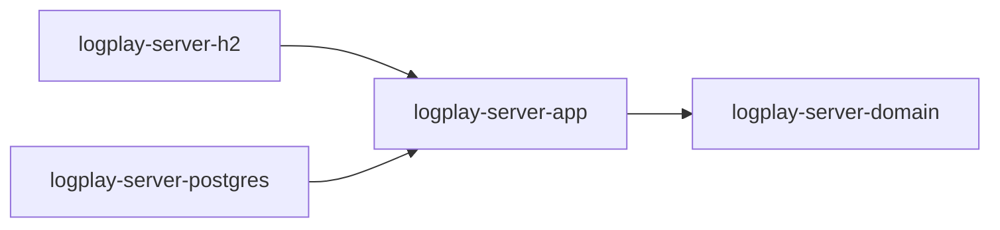
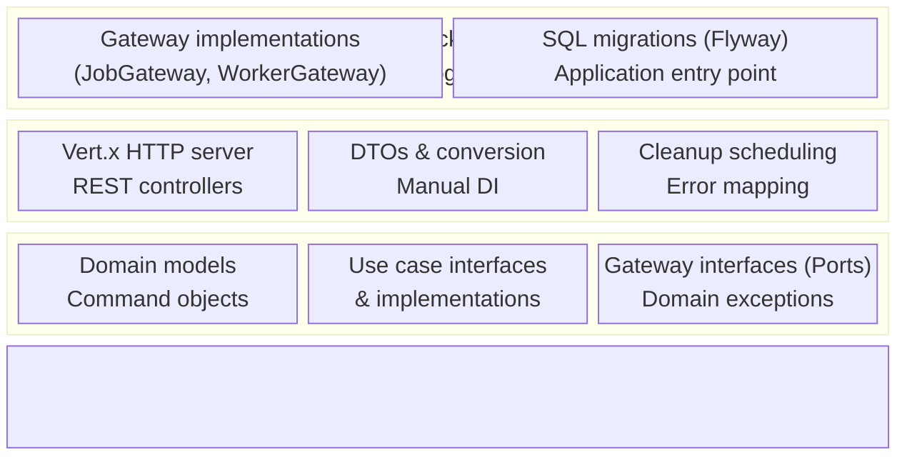
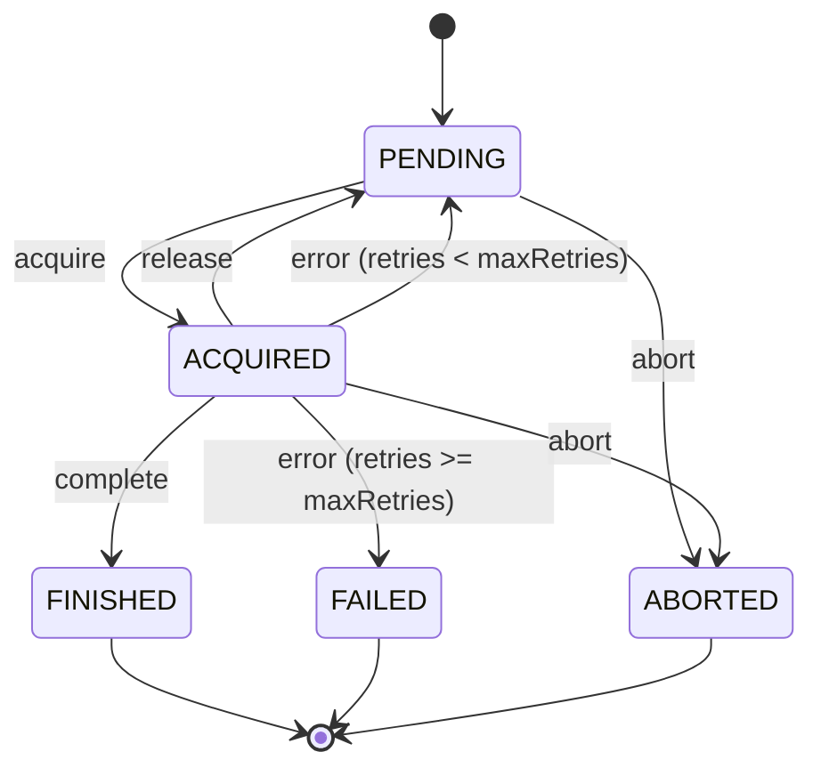
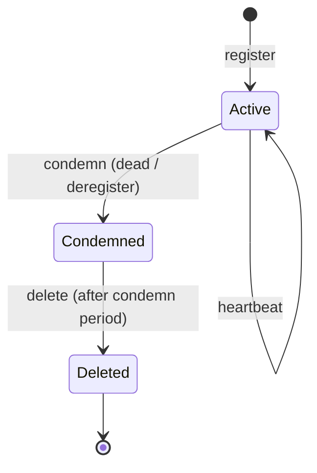
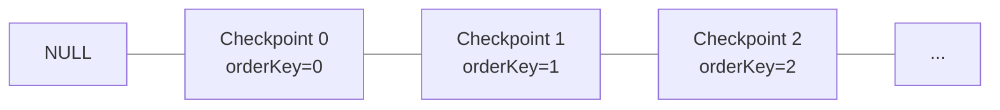
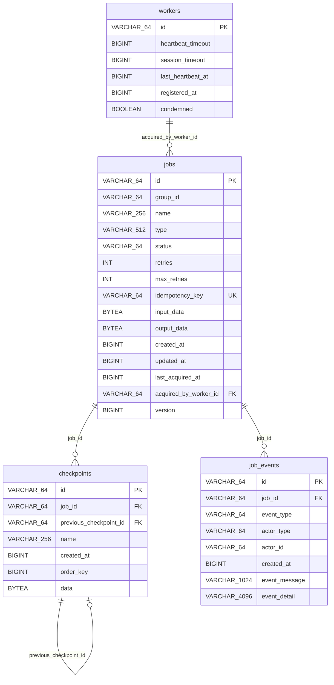
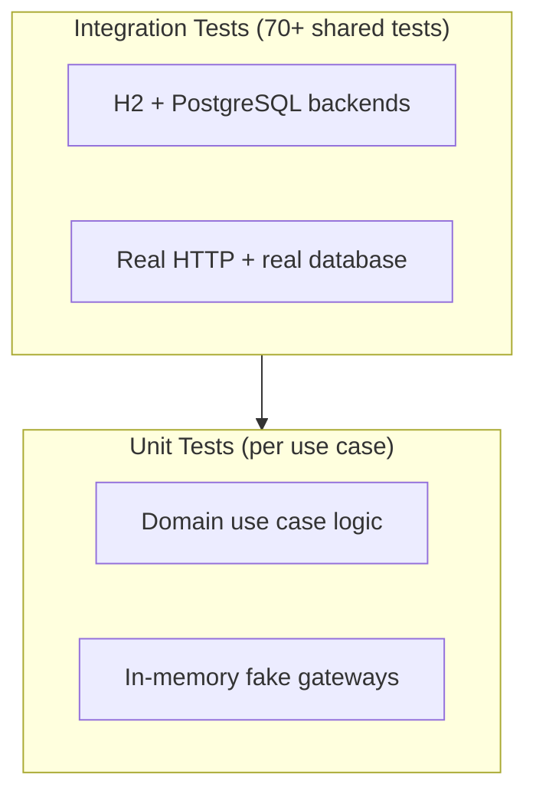

# LogPlay Server - Detailed Design Document

> **Version:** 0.0.1  
> **Last updated:** 2026-04-26  
> **Status:** Living document reflecting the current implementation

---

## Table of Contents

1. [Overview](#1-overview)
2. [Architecture](#2-architecture)
3. [Module Structure](#3-module-structure)
4. [Domain Model](#4-domain-model)
5. [Job Lifecycle State Machine](#5-job-lifecycle-state-machine)
6. [Worker Lifecycle](#6-worker-lifecycle)
7. [Checkpoint System](#7-checkpoint-system)
8. [Event Audit Trail](#8-event-audit-trail)
9. [HTTP API Contract](#9-http-api-contract)
10. [Database Schema](#10-database-schema)
11. [Concurrency & Consistency Model](#11-concurrency--consistency-model)
12. [Error Handling Strategy](#12-error-handling-strategy)
13. [Testing Strategy](#13-testing-strategy)
14. [Configuration & Deployment](#14-configuration--deployment)
15. [Technology Stack](#15-technology-stack)
16. [Scalability Limits](#16-scalability-limits)
17. [Scalability Improvements](#17-scalability-improvements)

---

## 1. Overview

LogPlay Server is a **durable execution platform** that enables long-running, fault-tolerant workflows written in plain code. The server guarantees that workflows run to completion even across process restarts, network failures, or arbitrary delays.

### Design Philosophy

- **Separation of concerns:** The server handles orchestration (job queueing, state machine, checkpoint storage); client SDKs handle execution (business logic, checkpoint creation, replay on resume).
- **Database-agnostic domain:** Core business logic has zero framework or driver dependencies. Persistence is pluggable via gateway interfaces.
- **Coroutine-native:** All I/O operations are `suspend` functions, enabling non-blocking execution on the Vert.x event loop.

### Core Concepts

| Concept | Description |
|---------|-------------|
| **Job** | A unit of durable work that progresses through a well-defined state machine |
| **Worker** | A registered execution context that acquires and processes jobs |
| **Checkpoint** | A durable snapshot of execution progress forming a linked chain |
| **Event** | An immutable audit record of every state transition in a job's lifecycle |

---

## 2. Architecture

The system follows **Clean Architecture** with **Hexagonal Architecture (Ports & Adapters)** principles, organized into four Gradle modules with strictly enforced dependency rules.

### Dependency Graph



### Layer Responsibilities



### Key Architectural Decisions

1. **Screaming Architecture:** The domain is organized by feature (`job/`, `worker/`), not by technical concern. This makes the codebase navigable by business concept.

2. **Manual DI over framework DI:** Use case instantiation is handled by `JobUseCaseLookUp` and `WorkerUseCaseLookUp` factory classes rather than a DI container. This keeps startup simple and dependency graphs explicit.

3. **Gateway compute pattern:** Complex transactional operations (e.g., `saveCheckpoint`, `reportExecutionError`) pass a compute function to the gateway. The gateway handles locking and transaction management; the domain function computes the new state. This keeps domain logic pure while allowing the gateway to enforce transactional guarantees.

---

## 3. Module Structure

### logplay-server-domain

```
src/main/kotlin/org/zeplinko/logplay/server/core/
├── job/
│   ├── Models.kt          # Job, Checkpoint, command/response data classes
│   ├── Enums.kt           # JobStatus, JobEventType, ActorType
│   ├── Ports.kt           # JobGateway interface
│   ├── UseCase.kt         # Use case interfaces
│   ├── Exception.kt       # Domain exceptions (20 exception types)
│   └── impl/
│       ├── CreateJobUseCaseImpl.kt
│       ├── AcquirePendingJobsUseCaseImpl.kt
│       ├── SaveJobCheckpointUseCaseImpl.kt
│       ├── GetCheckpointsUseCaseImpl.kt
│       ├── CompleteJobUseCaseImpl.kt
│       ├── ReleaseJobUseCaseImpl.kt
│       ├── ReportExecutionErrorUseCaseImpl.kt
│       ├── AbortJobUseCaseImpl.kt
│       └── GetJobEventsUseCaseImpl.kt
└── worker/
    ├── Models.kt          # Worker, command data classes
    ├── Ports.kt           # WorkerGateway interface
    ├── UseCase.kt         # Use case interfaces
    ├── Exception.kt       # Domain exceptions (6 exception types)
    └── impl/
        ├── RegisterWorkerUseCaseImpl.kt
        ├── HeartbeatWorkerUseCaseImpl.kt
        ├── DeregisterWorkerUseCaseImpl.kt
        └── CleanupDeadWorkersUseCaseImpl.kt
```

### logplay-server-app

```
src/main/kotlin/org/zeplinko/logplay/server/
├── MainVerticle.kt                    # Vert.x entry point, HTTP server, cleanup scheduler
├── web/
│   └── Http.kt                        # ErrorResponse, request parsing utilities
├── job/
│   ├── web/
│   │   ├── JobController.kt           # Job REST endpoints
│   │   └── Dtos.kt                    # Job request/response DTOs
│   └── use/case/
│       └── JobUseCaseLookUp.kt        # Job use case factory
└── worker/
    ├── web/
    │   ├── WorkerController.kt        # Worker REST endpoints
    │   └── Dtos.kt                    # Worker request/response DTOs
    └── use/case/
        └── WorkerUseCaseLookUp.kt     # Worker use case factory

src/testFixtures/kotlin/org/zeplinko/logplay/server/test/
├── AbstractIntegrationTest.kt         # 70+ shared integration test cases
└── IntegrationTestBackend.kt          # Backend abstraction for tests
```

### logplay-server-h2 / logplay-server-postgres

```
src/main/kotlin/org/zeplinko/logplay/server/
├── {h2,postgres}/
│   └── Main.kt                        # Application entry point
└── job/adapters/
    ├── {H2,Postgres}JobGateway.kt     # JobGateway implementation
    └── {H2,Postgres}WorkerGateway.kt  # WorkerGateway implementation

src/main/resources/db/migration/
└── V1__create_jobs_and_checkpoints.sql # Flyway schema migration

src/test/kotlin/org/zeplinko/logplay/server/{h2,postgres}/
├── {H2,Postgres}IntegrationTest.kt    # Integration test runner
└── {H2,Postgres}TestBackend.kt        # Test backend setup
```

---

## 4. Domain Model

### 4.1 Job

The central entity representing a unit of durable work.

```kotlin
data class Job(
    val id: String,                      // UUIDv5 derived from (groupId, idempotencyKey)
    val groupId: String,                 // Multi-tenant group identifier (max 64 chars)
    val name: String,                    // Human-readable name (max 256 chars)
    val type: String,                    // Job type identifier (max 512 chars)
    val status: JobStatus,               // Current state in the lifecycle
    val retries: Int,                    // Current retry count
    val maxRetries: Int?,                // Max retries before FAILED (null = unlimited)
    val idempotencyKey: String,          // Unique dedup key per group (max 64 chars)
    val inputData: ByteArray?,           // Serialized input payload
    val createdAt: Instant,
    val updatedAt: Instant,
    val lastAcquiredAt: Instant?,        // When last acquired by a worker
    val acquiredByWorkerId: String?,     // Which worker currently holds this job
    val outputData: ByteArray?,          // Serialized output (set on completion)
    val version: Long,                   // Optimistic locking version
)
```

**Design notes:**
- `groupId` enables multi-tenant isolation. Multiple client services can share a single LogPlay deployment, each using their own group. Workers poll by `groupId` and `type` to acquire only their service's jobs of a specific type.
- `inputData`/`outputData` are raw `ByteArray` at the domain level; the HTTP layer handles Base64 encoding/decoding.
- `version` enables optimistic concurrency control. Every mutating operation increments the version and checks for concurrent modifications.
- `id` is not random. It is derived deterministically from `(groupId, idempotencyKey)` using UUIDv5 (SHA-1) against a fixed LogPlay namespace, with a length-prefixed name encoding so that no pair of distinct `(groupId, idempotencyKey)` inputs can serialize to the same bytes. The generator lives in `logplay-server-domain/.../core/job/JobIdGenerator.kt`. Idempotency uniqueness is therefore enforced by the primary key itself — no separate global unique index is needed. A consequence worth preserving: sharding by `hash(job_id)` in the future will automatically route identical idempotency keys to the same shard, because `job_id` is a pure function of the key.
- `idempotencyKey` is unique per group (not globally), allowing different services to independently use the same key without conflict.
- `retries` resets to 0 when a new checkpoint is saved, acknowledging forward progress.

### 4.2 Checkpoint

A durable snapshot of execution progress forming a singly-linked chain.

```kotlin
data class Checkpoint(
    val id: String,                      // UUID, system-generated
    val jobId: String,                   // Parent job
    val previousCheckpointId: String?,   // Previous checkpoint in chain (null for first)
    val name: String?,                   // Optional human-readable step name (max 256 chars)
    val createdAt: Instant,
    val orderKey: Long,                  // Monotonically increasing order within a job
    val data: ByteArray?,                // Serialized checkpoint payload (nullable — workers may save chain markers without payloads)
)
```

**Design notes:**
- `previousCheckpointId` forms a linked chain. The database enforces uniqueness on `(job_id, COALESCE(previous_checkpoint_id, 'ROOT'))`, preventing concurrent checkpoint writes to the same position.
- `orderKey` provides an efficient ordering mechanism separate from the chain. It is the previous checkpoint's `orderKey + 1`, starting at 0.
- `data` is the serialized payload. The client SDK uses the checkpoint's type information to deserialize back to the correct class on replay.
- Custom `equals`/`hashCode` based on `id` only (since `data` is a `ByteArray`).

### 4.3 Worker

A registered execution context that acquires and processes jobs.

```kotlin
data class Worker(
    val id: String,                      // Client-provided worker identifier (max 64 chars)
    val heartbeatTimeout: Long,          // Expected heartbeat interval (ms)
    val sessionTimeout: Long,            // Max time before worker is considered dead (ms)
    val lastHeartbeatAt: Instant,        // Last received heartbeat
    val registeredAt: Instant,
    val condemned: Boolean = false,       // Marked for removal (soft delete)
)
```

**Design notes:**
- `sessionTimeout` must be greater than `heartbeatTimeout`. A worker that hasn't sent a heartbeat within `sessionTimeout` is considered dead.
- The `condemned` flag enables a two-phase cleanup: mark as condemned first, then release jobs, then delete. This prevents race conditions where a worker sends a heartbeat between job release and deletion.

### 4.4 JobEvent

An immutable audit record of a state transition.

```kotlin
data class JobEvent(
    val id: String,                      // UUID, system-generated
    val jobId: String,
    val eventType: JobEventType,
    val actorType: ActorType,            // WORKER or SYSTEM
    val actorId: String?,                // Worker ID if actor is WORKER
    val createdAt: Instant,
    val eventMessage: String?,           // Short description (max 1024 chars)
    val eventDetail: String?,            // Detailed info, e.g. error stack (max 4096 chars)
)
```

### 4.5 Command Objects

All use case inputs are modeled as immutable command objects:

| Command | Fields |
|---------|--------|
| `CreateJobCommand` | groupId, name, type, maxRetries?, idempotencyKey, inputData? |
| `AcquirePendingJobsCommand` | groupId, type, workerId, limit |
| `SaveJobCheckpointCommand` | jobId, workerId, previousCheckpointId?, name?, data? |
| `GetCheckpointsCommand` | jobId, after? (cursor), limit? |
| `CompleteJobCommand` | jobId, workerId, outputData? |
| `ReleaseJobCommand` | jobId, workerId |
| `ReportExecutionErrorCommand` | jobId, workerId, error? |
| `AbortJobCommand` | jobId |
| `RegisterWorkerCommand` | workerId, heartbeatTimeout, sessionTimeout |
| `HeartbeatWorkerCommand` | workerId |
| `DeregisterWorkerCommand` | workerId |

---

## 5. Job Lifecycle State Machine

### State Diagram



### Status Definitions

| Status | Description | Mutable? |
|--------|-------------|----------|
| `PENDING` | Waiting to be picked up by a worker | Yes - can be acquired or aborted |
| `ACQUIRED` | A worker is actively executing this job | Yes - can be completed, released, error-reported, or aborted |
| `FINISHED` | Worker explicitly completed the job | No - terminal state |
| `FAILED` | Exhausted all retry attempts | No - terminal state |
| `ABORTED` | Manually cancelled before completion | No - terminal state |

### Transition Rules

| From | To | Trigger | Actor | Side Effects |
|------|----|---------|-------|-------------|
| `PENDING` | `ACQUIRED` | `acquirePendingJobs` | Worker | Sets `acquiredByWorkerId`, `lastAcquiredAt`; increments `version`; creates ACQUIRED event |
| `ACQUIRED` | `FINISHED` | `completeJob` | Worker | Stores `outputData`; clears `acquiredByWorkerId`; creates COMPLETED event |
| `ACQUIRED` | `PENDING` | `releaseJob` | Worker | Clears `acquiredByWorkerId`; creates RELEASED event |
| `ACQUIRED` | `PENDING` | `reportExecutionError` (retries < maxRetries) | Worker | Increments `retries`; clears `acquiredByWorkerId`; creates ERROR_REPORTED event |
| `ACQUIRED` | `FAILED` | `reportExecutionError` (retries >= maxRetries) | System | Increments `retries`; creates ERROR_REPORTED + FAILED events atomically |
| `PENDING` | `ABORTED` | `abortJob` | System | Creates ABORTED event |
| `ACQUIRED` | `ABORTED` | `abortJob` | System | Clears `acquiredByWorkerId`; creates ABORTED event |

### Retry Mechanics

- `retries` increments on each `reportExecutionError` call.
- When `retries >= maxRetries`, the job transitions to `FAILED` (terminal).
- When `retries < maxRetries`, the job returns to `PENDING` for re-acquisition.
- **Retry reset on progress:** When a checkpoint is saved, `retries` resets to 0. This acknowledges that the worker has made forward progress and gives it a fresh set of retries from the latest checkpoint.
- If `maxRetries` is `null`, the job can be retried indefinitely.

---

## 6. Worker Lifecycle

### State Diagram



### Registration

A worker registers with the server providing:
- `workerId` (client-chosen, max 64 chars, unique)
- `heartbeatTimeout` (expected heartbeat interval in ms, must be > 0)
- `sessionTimeout` (max time without heartbeat before declared dead, must be > `heartbeatTimeout`)

### Heartbeat Protocol

Workers must periodically send heartbeats to prove liveness. The server updates `lastHeartbeatAt` on each heartbeat. A condemned worker's heartbeat is rejected with a `403 Forbidden` response.

### Deregistration (Explicit)

When a worker explicitly deregisters (e.g., graceful shutdown):
1. The worker is marked as `condemned`
2. All jobs acquired by the worker are released back to `PENDING`
3. The worker record is deleted

### Dead Worker Cleanup (Automatic)

A periodic cleanup task runs every 30 seconds (configurable) and performs a **two-phase cleanup**:

**Phase 1 - Condemn:** Find all workers where `now - lastHeartbeatAt > sessionTimeout` and `condemned = false`. Mark them as `condemned`.

**Phase 2 - Delete:** Find all workers where `condemned = true` and the condemn period (default 15 seconds) has elapsed. Release all their acquired jobs back to `PENDING`, then delete the worker records.

**Why two phases?** A single-phase approach (detect dead + release jobs + delete) is vulnerable to race conditions: a worker could heartbeat between job release and deletion. The condemn phase ensures a grace period where the worker is locked out (heartbeats return `403`) before its jobs are released.

---

## 7. Checkpoint System

### Linked Chain Design

Checkpoints form a singly-linked list per job. Each checkpoint references its predecessor:



### Chain Integrity Enforcement

The database enforces a unique constraint on `(job_id, COALESCE(previous_checkpoint_id, 'ROOT'))`. This means:
- Only one checkpoint can have `previousCheckpointId = null` per job (the root).
- Only one checkpoint can point to any given predecessor per job.
- This prevents concurrent checkpoint writes to the same position in the chain.

### Save Checkpoint Flow

1. Validate inputs (jobId, workerId, name length)
2. Lock the job row (`SELECT FOR UPDATE`)
3. Verify job is `ACQUIRED` and owned by the requesting worker
4. Fetch the latest checkpoint for the job
5. Validate that `previousCheckpointId` matches the latest checkpoint's ID (or is null if no checkpoints exist)
6. Create the new checkpoint with `orderKey = lastCheckpoint.orderKey + 1`
7. **Reset job retries to 0** (acknowledges forward progress)
8. Update job `version` and `updatedAt`

### Cursor-Based Pagination

Checkpoints are retrieved via cursor-based pagination using `orderKey`:

```
GET /api/v1/jobs/:jobId/checkpoints?after={checkpointId}&limit={n}
```

- `after` is a checkpoint ID. The server looks up that checkpoint's `orderKey` and returns checkpoints with `orderKey > afterOrderKey`.
- Default `limit` is 20, maximum is 100.
- Response includes `hasMore: boolean` to indicate whether more pages exist.
- The `+1` fetch technique is used: query for `limit + 1` rows, return `limit` rows, set `hasMore = true` if `limit + 1` rows were returned.

---

## 8. Event Audit Trail

Every state transition in a job's lifecycle produces an immutable `JobEvent` record.

### Event Types

| Event Type | Actor | When |
|-----------|-------|------|
| `CREATED` | `SYSTEM` | Job is created |
| `ACQUIRED` | `WORKER` | Worker acquires the job |
| `RELEASED` | `WORKER` | Worker releases the job back to PENDING |
| `COMPLETED` | `WORKER` | Worker completes the job |
| `ERROR_REPORTED` | `WORKER` | Worker reports an execution error |
| `FAILED` | `SYSTEM` | Job exhausts all retries (created atomically with ERROR_REPORTED) |
| `ABORTED` | `SYSTEM` | Job is manually aborted |

### Event Atomicity

Events are always created atomically with their corresponding state transitions within the same database transaction. For example, when a job fails after max retries, both the `ERROR_REPORTED` event and the `FAILED` event are inserted in a single transaction.

### Event Fields

- `eventMessage` (max 1024 chars): Short description of the event (e.g., "Job acquired by worker-1")
- `eventDetail` (max 4096 chars): Extended information (e.g., full error message/stack trace for ERROR_REPORTED events)

---

## 9. HTTP API Contract

### Base URL

All endpoints are versioned under `/api/v1`. The v1 router is mounted as a Vert.x sub-router, allowing future API versions to coexist.

### Job Endpoints

#### POST /api/v1/jobs

Create a new job.

**Request:**
```json
{
    "groupId": "order-service",
    "name": "process-order-123",
    "type": "order-processing",
    "maxRetries": 3,
    "idempotencyKey": "order-123-v1",
    "inputData": "<base64-encoded>"
}
```

| Field | Required | Default | Constraints |
|-------|----------|---------|-------------|
| `groupId` | yes | - | Non-blank, max 64 chars |
| `name` | no | Auto-generated UUID | Max 256 chars |
| `type` | yes | - | Non-blank, max 512 chars |
| `maxRetries` | no | null (unlimited) | Must be > 0 if provided |
| `idempotencyKey` | yes | - | Non-blank, max 64 chars; unique per group. Omitting it returns 400 — the server does not auto-generate one, because `job_id` is derived from this field and an auto-generated key would silently nullify idempotency on retry. |
| `inputData` | no | null | Valid Base64 |

**Response (201):**
```json
{
    "id": "550e8400-e29b-41d4-a716-446655440000",
    "groupId": "order-service",
    "name": "process-order-123",
    "type": "order-processing",
    "status": "PENDING",
    "retries": 0,
    "maxRetries": 3,
    "idempotencyKey": "order-123-v1",
    "inputData": "<base64-encoded>",
    "createdAt": "2026-04-10T12:00:00Z",
    "updatedAt": "2026-04-10T12:00:00Z",
    "version": 0
}
```

---

#### POST /api/v1/jobs/acquire

Atomically acquire pending jobs for a worker.

**Request:**
```json
{
    "groupId": "order-service",
    "type": "order-processing",
    "workerId": "worker-1",
    "limit": 5
}
```

| Field | Required | Default | Constraints |
|-------|----------|---------|-------------|
| `groupId` | yes | - | Non-blank, max 64 chars |
| `type` | yes | - | Non-blank, max 512 chars |
| `workerId` | yes | - | Non-blank, registered, not condemned |
| `limit` | no | 10 | 1-100 |

**Response (200):** Array of acquired `Job` objects.

**Acquisition semantics:**
- Filters by `groupId` AND `type` to scope the acquisition
- Uses `SELECT ... FOR UPDATE SKIP LOCKED` to prevent contention
- Orders by `updated_at ASC` (oldest pending jobs first)
- Validates worker exists and is not condemned before acquiring
- Returns empty array (not an error) if no pending jobs exist

---

#### GET /api/v1/jobs/:jobId/checkpoints

Retrieve checkpoints with cursor-based pagination.

**Query Parameters:**

| Param | Required | Default | Constraints |
|-------|----------|---------|-------------|
| `after` | no | null (from start) | Must be a valid checkpoint ID |
| `limit` | no | 20 | 1-100 |

**Response (200):**
```json
{
    "checkpoints": [
        {
            "id": "...",
            "jobId": "...",
            "previousCheckpointId": null,
            "name": "step-1",
            "createdAt": "2026-04-10T12:00:00Z",
            "data": "<base64-encoded>"
        }
    ],
    "hasMore": true
}
```

---

#### POST /api/v1/jobs/:jobId/checkpoints

Save a new checkpoint.

**Request:**
```json
{
    "workerId": "worker-1",
    "previousCheckpointId": "prev-checkpoint-id-or-null",
    "name": "payment-processed",
    "data": "<base64-encoded>"
}
```

| Field | Required | Default | Constraints |
|-------|----------|---------|-------------|
| `workerId` | yes | - | Must own the job |
| `previousCheckpointId` | no | null | Must match the last checkpoint |
| `name` | no | null | Max 256 chars |
| `data` | no | null | Valid Base64 if provided |

**Response (201):** Created `Checkpoint` object.

---

#### POST /api/v1/jobs/:jobId/complete

Mark an acquired job as finished.

**Request:**
```json
{
    "workerId": "worker-1",
    "outputData": "<base64-encoded>"
}
```

**Response (200):** Updated `Job` object with status `FINISHED`.

---

#### POST /api/v1/jobs/:jobId/release

Release an acquired job back to PENDING.

**Request:**
```json
{
    "workerId": "worker-1"
}
```

**Response (200):** Updated `Job` object with status `PENDING`.

---

#### POST /api/v1/jobs/:jobId/error

Report an execution error.

**Request:**
```json
{
    "workerId": "worker-1",
    "error": "NullPointerException at line 42"
}
```

**Response (200):** Updated `Job` object. Status will be `PENDING` (retryable) or `FAILED` (exhausted retries).

---

#### POST /api/v1/jobs/:jobId/abort

Abort a job. Can only abort jobs in `PENDING` or `ACQUIRED` status.

**Request:** Empty body.

**Response (200):** Updated `Job` object with status `ABORTED`.

---

#### GET /api/v1/jobs/:jobId/events

Get the full event timeline for a job.

**Response (200):** Array of `JobEvent` objects ordered by `created_at`.

---

### Worker Endpoints

#### POST /api/v1/workers

Register a new worker.

**Request:**
```json
{
    "workerId": "worker-1",
    "heartbeatTimeout": 5000,
    "sessionTimeout": 15000
}
```

| Field | Required | Constraints |
|-------|----------|-------------|
| `workerId` | yes | Non-blank, max 64 chars, unique |
| `heartbeatTimeout` | yes | > 0 |
| `sessionTimeout` | yes | > 0, > heartbeatTimeout |

**Response (201):** Created `Worker` object.

---

#### POST /api/v1/workers/:workerId/heartbeat

Send a heartbeat for a registered worker.

**Request:** Empty body.

**Response (200):** Updated `Worker` object with refreshed `lastHeartbeatAt`.

---

#### DELETE /api/v1/workers/:workerId

Deregister a worker. Releases all acquired jobs back to PENDING.

**Response (204):** No content.

---

### Error Response Format

All error responses follow a consistent format:

```json
{
    "error": "Human-readable error message"
}
```

### HTTP Status Code Mapping

| Status | Domain Exceptions |
|--------|------------------|
| **400** | `BlankJobTypeException`, `InvalidJobTypeException`, `InvalidJobNameException`, `BlankJobIdException`, `BlankWorkerIdException`, `InvalidWorkerIdException`, `InvalidCheckpointNameException`, `InvalidCheckpointDataException`, `InvalidJobInputDataException`, `InvalidJobOutputDataException`, `InvalidMaxRetriesException`, `BlankIdempotencyKeyException`, `InvalidIdempotencyKeyException`, `InvalidLimitException`, `InvalidWorkerTimeoutException`, `InvalidRequestBodyException`, `InvalidQueryParameterException` |
| **403** | `WorkerCondemnedException` |
| **404** | `JobNotFoundException`, `CheckpointNotFoundException`, `WorkerNotFoundException` |
| **409** | `DuplicateIdempotencyKeyException`, `JobNotAcquiredException`, `JobNotAbortableException`, `JobNotOwnedByWorkerException`, `JobConcurrentModificationException`, `InvalidCheckpointOrderException`, `WorkerAlreadyRegisteredException` |
| **500** | All unhandled exceptions (logged with request method and path) |

---

## 10. Database Schema

### Entity-Relationship Diagram



### Table: `jobs`

| Column | Type | Constraints |
|--------|------|-------------|
| `id` | VARCHAR(64) | PRIMARY KEY |
| `group_id` | VARCHAR(64) | NOT NULL |
| `name` | VARCHAR(256) | NOT NULL |
| `type` | VARCHAR(512) | NOT NULL |
| `status` | VARCHAR(64) | NOT NULL |
| `retries` | INT | NOT NULL, DEFAULT 0 |
| `max_retries` | INT | NULLABLE |
| `created_at` | BIGINT | NOT NULL (epoch ms) |
| `updated_at` | BIGINT | NOT NULL (epoch ms) |
| `version` | BIGINT | NOT NULL, DEFAULT 0 |
| `last_acquired_at` | BIGINT | NULLABLE (epoch ms) |
| `acquired_by_worker_id` | VARCHAR(64) | NULLABLE, FK → workers(id) |
| `idempotency_key` | VARCHAR(64) | NOT NULL, UNIQUE INDEX |
| `input_data` | BINARY VARYING / BYTEA | NULLABLE |
| `output_data` | BINARY VARYING / BYTEA | NULLABLE |

**Indexes:**
- `idx_jobs_status_updated_at` on `(group_id, type, status, updated_at)` -- for efficient group+type-scoped job acquisition
- `idx_jobs_acquired_worker` on `(acquired_by_worker_id, status)` -- for releasing jobs by worker

Idempotency uniqueness is enforced by the primary key: `jobs.id` is derived deterministically from `(group_id, idempotency_key)` via `JobIdGenerator` (UUIDv5 over a fixed LogPlay namespace with length-prefixed name encoding), so a duplicate insert collides on the `jobs` PK and no separate unique index is needed. On collision, both gateway implementations translate the PK violation into `DuplicateIdempotencyKeyException` → HTTP 409. The server does **not** return the existing job on duplicate — duplicates are surfaced as conflicts rather than silently deduplicated, so that a client whose retry differs in `name`, `type`, `maxRetries`, or `inputData` sees the mismatch instead of having it hidden.

### Table: `checkpoints`

| Column | Type | Constraints |
|--------|------|-------------|
| `id` | VARCHAR(64) | PRIMARY KEY |
| `job_id` | VARCHAR(64) | NOT NULL, FK → jobs(id) |
| `previous_checkpoint_id` | VARCHAR(64) | NULLABLE, FK → checkpoints(id) |
| `name` | VARCHAR(256) | NULLABLE |
| `created_at` | BIGINT | NOT NULL (epoch ms) |
| `order_key` | BIGINT | NOT NULL, DEFAULT 0 |
| `data` | BINARY VARYING / BYTEA | NULLABLE |

**Indexes & Constraints:**
- `idx_checkpoints_job_order` on `(job_id, order_key)` -- query performance for pagination
- Chain uniqueness is enforced by the primary key: `checkpoints.id` is derived deterministically from `(job_id, previous_checkpoint_id)` via `CheckpointIdGenerator`, so a duplicate chain position collides on the PK and no separate unique index is needed.
- Order uniqueness needs no index either: `order_key` is computed server-side inside a `FOR UPDATE` lock on the job row, making collisions unreachable.

### Table: `workers`

| Column | Type | Constraints |
|--------|------|-------------|
| `id` | VARCHAR(64) | PRIMARY KEY |
| `heartbeat_timeout` | BIGINT | NOT NULL (ms) |
| `session_timeout` | BIGINT | NOT NULL (ms) |
| `last_heartbeat_at` | BIGINT | NOT NULL (epoch ms) |
| `registered_at` | BIGINT | NOT NULL (epoch ms) |
| `condemned` | BOOLEAN | NOT NULL, DEFAULT FALSE |

### Table: `job_events`

| Column | Type | Constraints |
|--------|------|-------------|
| `id` | VARCHAR(64) | PRIMARY KEY |
| `job_id` | VARCHAR(64) | NOT NULL, FK → jobs(id) |
| `event_type` | VARCHAR(64) | NOT NULL |
| `actor_type` | VARCHAR(64) | NOT NULL |
| `actor_id` | VARCHAR(64) | NULLABLE |
| `created_at` | BIGINT | NOT NULL (epoch ms) |
| `event_message` | VARCHAR(1024) | NULLABLE |
| `event_detail` | VARCHAR(4096) | NULLABLE |

**Indexes:**
- `idx_job_events_job_id` on `(job_id)`

### Timestamp Strategy

All timestamps are stored as `BIGINT` (epoch milliseconds) rather than database-native timestamp types. This ensures:
- Consistent behavior across H2 and PostgreSQL
- No timezone ambiguity
- Straightforward serialization to/from `java.time.Instant`

---

## 11. Concurrency & Consistency Model

### Optimistic Locking

Jobs use a `version` field for optimistic concurrency control. Every mutating operation:
1. Reads the current job (within a transaction, locked)
2. Performs the business logic
3. Updates the job with `version = version + 1`
4. If the update affects 0 rows (version mismatch), throws `JobConcurrentModificationException`

### Pessimistic Locking (Job Acquisition)

Job acquisition uses `SELECT ... FOR UPDATE SKIP LOCKED`:
- `FOR UPDATE` prevents two workers from acquiring the same job
- `SKIP LOCKED` prevents workers from blocking on locked rows, ensuring high throughput even under contention
- Jobs are ordered by `updated_at ASC` (FIFO)

### Transactional Boundaries

Complex operations use explicit transaction boundaries within gateway implementations:

| Operation | Locked Resources | Transaction Scope |
|-----------|-----------------|-------------------|
| `acquirePendingJobs` | Job rows (SKIP LOCKED) | SELECT + UPDATE jobs + INSERT events |
| `saveCheckpoint` | Job row (FOR UPDATE) | SELECT job + SELECT last checkpoint + INSERT checkpoint + UPDATE job |
| `reportExecutionError` | Job row (FOR UPDATE) | SELECT job + UPDATE job + INSERT event(s) |
| `completeJob` | Job row (within transaction) | UPDATE job + INSERT event |
| `releaseJob` | Job row (within transaction) | UPDATE job + INSERT event |
| `abortJob` | Job row (within transaction) | UPDATE job + INSERT event |
| `insertJobWithEvent` | - | INSERT job + INSERT event |

### Checkpoint Chain Consistency

The unique constraint on `(job_id, COALESCE(previous_checkpoint_id, 'ROOT'))` provides a database-level guarantee that:
- Only one root checkpoint (with `previousCheckpointId = null`) can exist per job
- No two checkpoints can claim the same predecessor within a job
- Concurrent checkpoint saves to the same position will result in one succeeding and one failing with `InvalidCheckpointOrderException`

### Gateway Compute Pattern

For operations requiring complex domain logic within a transaction, the gateway accepts a compute function:

```kotlin
// Domain use case provides the logic
suspend fun saveCheckpoint(
    jobId: String,
    workerId: String,
    updatedAt: Instant,
    compute: (Job, Checkpoint?) -> Checkpoint,  // domain logic
): Checkpoint?

// Gateway implementation:
// 1. BEGIN TRANSACTION
// 2. SELECT job FOR UPDATE
// 3. SELECT last checkpoint
// 4. Call compute(job, lastCheckpoint) → new Checkpoint
// 5. INSERT checkpoint
// 6. UPDATE job (reset retries, bump version)
// 7. COMMIT
```

This pattern keeps domain logic pure (no awareness of transactions or locking) while letting the gateway enforce consistency guarantees.

---

## 12. Error Handling Strategy

### Exception Hierarchy

```mermaid
classDiagram
    RuntimeException <|-- JobException
    RuntimeException <|-- WorkerException
    RuntimeException <|-- InvalidRequestBodyException
    RuntimeException <|-- InvalidQueryParameterException

    JobException <|-- BlankJobTypeException
    JobException <|-- InvalidJobTypeException
    JobException <|-- InvalidJobNameException
    JobException <|-- BlankJobIdException
    JobException <|-- InvalidCheckpointNameException
    JobException <|-- DuplicateIdempotencyKeyException
    JobException <|-- BlankIdempotencyKeyException
    JobException <|-- InvalidIdempotencyKeyException
    JobException <|-- JobNotFoundException
    JobException <|-- JobNotAcquiredException
    JobException <|-- JobConcurrentModificationException
    JobException <|-- CheckpointNotFoundException
    JobException <|-- InvalidCheckpointOrderException
    JobException <|-- InvalidMaxRetriesException
    JobException <|-- InvalidCheckpointDataException
    JobException <|-- InvalidJobInputDataException
    JobException <|-- InvalidJobOutputDataException
    JobException <|-- InvalidLimitException
    JobException <|-- JobNotAbortableException
    JobException <|-- JobNotOwnedByWorkerException

    WorkerException <|-- BlankWorkerIdException
    WorkerException <|-- InvalidWorkerIdException
    WorkerException <|-- WorkerNotFoundException
    WorkerException <|-- WorkerAlreadyRegisteredException
    WorkerException <|-- InvalidWorkerTimeoutException
    WorkerException <|-- WorkerCondemnedException

    class JobException {
        <<abstract>>
    }
    class WorkerException {
        <<abstract>>
    }
```



### Design Principles

1. **Specific exceptions over generic:** Each error condition has its own exception class. No catch-all "validation error" types.
2. **Domain exceptions are HTTP-agnostic:** Exception classes don't know about HTTP status codes. The `MainVerticle.handleFailure()` method maps exceptions to status codes.
3. **Centralized error mapping:** A single `when` expression in `handleFailure()` maps all known exceptions to HTTP status codes. Unknown exceptions default to 500.
4. **Consistent error format:** Every error response is `{"error": "message"}` regardless of the HTTP status code.
5. **Structured logging for 500s:** Unhandled exceptions log the full stack trace along with the HTTP method and path.

### Validation Strategy

Validation occurs at two levels:

**DTO level (app module):** Validates Base64 encoding, required field presence, type conversions.

**Use case level (domain module):** Validates business rules (field lengths, value ranges, state preconditions). Validation happens at the top of each `execute()` method before any I/O.

| Validation | Where | Exception |
|-----------|-------|-----------|
| Request body JSON parsing | `Http.parseBody<T>()` | `InvalidRequestBodyException` |
| Required field presence | DTO `toCommand()` | Various `Blank*Exception` |
| Base64 encoding validity | DTO `toCommand()` | `Invalid*DataException` |
| Query parameter parsing | Controller | `InvalidQueryParameterException` |
| Field length limits | Use case | `Invalid*Exception` |
| Numeric ranges | Use case | `InvalidLimitException`, `InvalidMaxRetriesException` |
| Business state preconditions | Use case | `JobNotAcquiredException`, `JobNotAbortableException`, etc. |
| Database constraints | Gateway | `DuplicateIdempotencyKeyException`, `InvalidCheckpointOrderException` |

---

## 13. Testing Strategy

### Test Pyramid



### Unit Tests (logplay-server-domain)

Each use case implementation has a corresponding test class using:
- **In-memory fake gateways** (`InMemoryJobGateway`, `InMemoryWorkerGateway`) that store data in plain `MutableList` collections
- **kotlinx-coroutines-test** for coroutine testing
- **AssertJ** for fluent assertions
- **JUnit Jupiter 5** as the test framework

Tests cover:
- Happy path execution
- Input validation (all boundary conditions)
- State precondition violations
- Concurrent modification scenarios
- Edge cases (null optionals, max lengths, etc.)

### Integration Tests (logplay-server-h2, logplay-server-postgres)

A single `AbstractIntegrationTest` class (70+ test cases) in the `testFixtures` configuration of `logplay-server-app` is reused by both database backends:

- **H2 backend:** Uses an in-memory H2 database. No external dependencies.
- **PostgreSQL backend:** Uses **Testcontainers** to spin up a real PostgreSQL instance in Docker.

Integration tests exercise the full stack:
1. HTTP request → Vert.x router → Controller → Use Case → Gateway → Database
2. Verify HTTP response status codes and JSON bodies
3. Use the Vert.x `WebClient` for HTTP assertions

**Test separation:** Integration tests are tagged with `@Tag("integration")` and excluded from the default `test` task. A separate `integrationTest` Gradle task includes only tagged tests.

### Test Categories Covered

| Category | Examples |
|----------|---------|
| Full lifecycle | Create → Acquire → Checkpoint → Complete |
| Release & re-acquire | Release → re-acquire by different worker |
| Checkpoint ordering | Sequential chain, invalid order detection |
| Checkpoint pagination | Cursor-based, limit enforcement, same-timestamp handling |
| Error reporting & retries | Error → retry → checkpoint → retry reset → max retries → FAILED |
| Abort | Abort from PENDING, ACQUIRED; reject abort from FINISHED/FAILED/ABORTED |
| Event audit trail | Full event timeline, event atomicity, error details |
| Input/Output data | Base64 round-trip encoding |
| Worker lifecycle | Register → heartbeat → deregister with job release |
| Validation (400) | Missing fields, blank values, invalid Base64, invalid limits |
| Not found (404) | Non-existent jobs, workers, checkpoints |
| Conflict (409) | Duplicate idempotency keys, wrong state, wrong worker, duplicate registration |

---

## 14. Configuration & Deployment

### Configuration Properties

| Property | Type | Default | Description |
|----------|------|---------|-------------|
| `http.port` | Integer | 8080 | HTTP server listen port |
| `cleanup.interval.ms` | Long | 30000 | Dead worker cleanup interval |
| `cleanup.condemn.period.ms` | Long | 15000 | Grace period after condemning before deletion |

### PostgreSQL Environment Variables

| Variable | Default | Description |
|----------|---------|-------------|
| `DB_HOST` | `localhost` | PostgreSQL host |
| `DB_PORT` | `5432` | PostgreSQL port |
| `DB_NAME` | `logplay` | Database name |
| `DB_USER` | `logplay` | Database user |
| `DB_PASSWORD` | (empty) | Database password |

### H2 Configuration

The H2 backend creates a file-based database at `./logplay-data` with `AUTO_SERVER=TRUE` for concurrent access.

### Deployment Artifacts

Fat JARs are produced via the Shadow plugin:

```bash
./gradlew :logplay-server-h2:shadowJar
# → logplay-server-h2/build/libs/logplay-server-h2-0.0.1-fat.jar

./gradlew :logplay-server-postgres:shadowJar
# → logplay-server-postgres/build/libs/logplay-server-postgres-0.0.1-fat.jar
```

Run with:
```bash
java -jar logplay-server-h2-0.0.1-fat.jar
# or
java -jar logplay-server-postgres-0.0.1-fat.jar
```

### Schema Migrations

Flyway runs automatically at application startup before the Vert.x verticle is deployed. Migrations are located at `classpath:db/migration/` within each backend module.

---

## 15. Technology Stack

| Concern | Technology | Version |
|---------|------------|---------|
| Language | Kotlin | 2.3.0 |
| JDK Toolchain | JDK | 25 |
| HTTP Server | Vert.x | 5.0.6 |
| Async Runtime | Kotlin Coroutines | 1.8.1 |
| JSON Serialization | Jackson + Kotlin Module | (managed by Vert.x BOM) |
| Dev/Test Database | H2 | 2.3.232 |
| Production Database | PostgreSQL | (via vertx-pg-client, async) |
| JDBC Driver (PostgreSQL) | PostgreSQL JDBC | 42.7.5 |
| Schema Migrations | Flyway | 11.5.0 |
| Logging Facade | SLF4J2 | (via Log4j2) |
| Logging Implementation | Log4j2 | 2.24.3 |
| Build System | Gradle | 9.2.1 |
| Fat JAR Packaging | Shadow | 9.2.2 |
| Code Formatting | Spotless + ktfmt | kotlinlangStyle |
| Testing | JUnit Jupiter | 5.10.0 |
| Assertions | AssertJ | 3.25.3 |
| Integration Testing | Testcontainers | 1.20.4 |
| Observability (wired) | OpenTelemetry | (via vertx-opentelemetry) |
| gRPC (wired) | Vert.x gRPC Server | (via vertx-grpc-server) |

### Build Plugin Architecture

Custom Gradle convention plugins in `buildSrc/`:

- **`module-base`**: Applies `java-library` + Spotless with ktfmt. Sets `group = "org.zeplinko.logplay"`, `version = "0.0.1"`.
- **`kotlin-module-base`**: Extends `module-base`, adds Kotlin JVM plugin, configures JDK 25 toolchain and Kotlin 2.3 language/API version.

All submodules apply `kotlin-module-base` for consistent configuration.

---

## 16. Scalability Limits

This section documents the known structural limits of the current design. It is a deliberately blunt list of "where this architecture will choke first" so that future work has an honest baseline. These are not bugs — the design is correct and clean for its current operating point. They are the points at which the single-primary, pull-based, one-table-per-concern approach stops paying rent as job volume grows toward the project's target of hundreds of millions of concurrent in-flight jobs.

The limits are presented in roughly the order they are expected to hurt.

### 16.1 Pull-based acquisition against a shared `jobs` table

`POST /api/v1/jobs/acquire` issues `SELECT ... FOR UPDATE SKIP LOCKED ORDER BY updated_at ASC` against `jobs`, scoped by `(group_id, type, status)`, and relies on `idx_jobs_status_updated_at`.

**Why it chokes:**
- Every worker poll is a database query, regardless of whether any job is ready. At 10⁵ workers polling at 1 Hz, that alone is 10⁵ qps on the primary before a single job moves.
- The index has a permanent hot spot at its leftmost leaves — the oldest `PENDING` rows for the largest group. Every acquisition walks the same corner of the B-tree. `SKIP LOCKED` eliminates blocking but not buffer-pool pressure or WAL fan-out.
- Dispatch latency is floor-limited by the poll interval. There is no push path for newly created jobs; a freshly inserted job waits until some worker's next poll to be picked up.
- Adding app instances does not help — they all land on the same primary.

### 16.2 MVCC bloat from high-frequency UPDATEs on `jobs`

Every job mutation (`acquire`, `saveCheckpoint`, `reportExecutionError`, `completeJob`, `releaseJob`, `abortJob`) is a non-HOT UPDATE: `status`, `updated_at`, `acquired_by_worker_id`, and `version` all participate in at least one index, so each update generates new index tuples.

**Why it chokes:**
- At 10⁸ in-flight rows with high transition rates, autovacuum struggles to keep up. Dead tuples accumulate on both the heap and the indexes used for acquisition (§16.1), and the acquisition path slows proportionally to the bloat it is causing.
- `saveCheckpoint` wraps a `SELECT ... FOR UPDATE` on the job row around an `INSERT` into `checkpoints` plus an `UPDATE` on `jobs` inside a single transaction. High-checkpoint-rate jobs serialize on their own row and double the write amplification per checkpoint.

### 16.3 Heartbeat write storm on `workers`

Every worker heartbeat is an HTTP call that turns into `UPDATE workers SET last_heartbeat_at = ...`. At 10⁵+ workers with a ~5-second heartbeat interval, this is tens of thousands of small writes per second to a single tiny table — pure WAL churn for liveness tracking.

**Why it chokes:**
- Each heartbeat consumes a database connection from a bounded pool. Heartbeats compete for connections with actual job work.
- The `CleanupDeadWorkersUseCase` sweep runs every 30 seconds and re-scans the workers table. The scan is cheap in isolation but competes with the same write traffic it is trying to observe.
- There is no in-process aggregation — every heartbeat traverses HTTP → controller → use case → gateway → DB.

### 16.4 Unbounded append logs without partitioning

`job_events` and `checkpoints` grow monotonically with every state transition and every checkpoint save. With ~5–10 events per job at 10⁸ concurrent jobs and ongoing churn, `job_events` alone heads toward 10⁹–10¹⁰ rows in one logical table.

**Why it chokes:**
- Neither table is partitioned (by `created_at`, by `job_id` hash, or by anything else). All inserts hit a single heap tail; all indexes cover the full table.
- `checkpoints` has a functional unique index on `(job_id, COALESCE(previous_checkpoint_id, 'ROOT'))`. It is elegant for chain-integrity enforcement but is a global unique index on a table you want to grow forever.
- `GET /api/v1/jobs/:jobId/events` is fine today, but cold-cache lookups against a 10¹⁰-row heap are not.
- Retention is undefined — see §16.6.

### 16.5 Global idempotency uniqueness

`uq_job_idempotency_key` is `UNIQUE (group_id, idempotency_key)` across the entire `jobs` table. Every `CreateJob` probes this index before insert.

**Why it chokes:**
- At 10⁸ jobs the index itself is very large (tens of GB, depending on key length). Every insert touches its hot leaves.
- The index is global: there is no sharding axis on which uniqueness can be enforced locally. Any future sharding effort will have to either derive `job_id` deterministically from `idempotency_key` (and let per-shard PK uniqueness do the work) or maintain a global dedup path.

### 16.6 No data lifecycle / retention policy

Terminal jobs (`FINISHED`, `FAILED`, `ABORTED`) and their associated `checkpoints` and `job_events` are never deleted. The "hot" operational tables carry the full history of the product indefinitely.

**Why it chokes:**
- Every limitation in §16.1–§16.5 degrades proportionally to retained history, not just to live in-flight volume.
- There is no archival story: no partition-drop path, no tiered storage, no periodic purge job. At the target scale, retention is load-bearing for operational health, not a nice-to-have.

### 16.7 Single writer, single blast radius

Even if §16.1–§16.6 were all addressed, a single PostgreSQL primary remains the sole writer.

**Why it chokes:**
- Max write throughput is bounded by one machine's WAL fsync rate and one machine's CPU.
- There is no horizontal write path. The control plane scales vertically only.
- One primary is one failure domain. A primary outage takes the entire cluster offline; failover latency is the recovery time objective for every tenant simultaneously.
- Sharding the control plane is not a configuration change — it is an architecture change, because the app tier is stateless and carries no shard ownership concept. This is the motivating observation behind `docs/design/stateful-server-architecture.md`.

### 16.8 Estimated headroom

| Operating point | Concurrent in-flight jobs | Comfortable? | Notes |
| --- | --- | --- | --- |
| Single tenant, light load | up to ~10^5 | Yes | Current design is well-matched. |
| Multi-tenant, mid load | ~10^5 to 10^6 | Yes, with tuning | Vacuum tuning, connection pool sizing, retention policy. |
| Large fleet | ~10^6 to 10^7 | Needs 16.1 + 16.3 + 16.4 fixes | Push dispatch (`LISTEN/NOTIFY` or long-poll), heartbeat aggregation, event-table partitioning. |
| Target | ~10^8 | No | Requires sharding the control plane. See `stateful-server-architecture.md`. |

These are order-of-magnitude estimates, not benchmarks. The point is the shape of the curve: incremental tuning buys roughly one order of magnitude of headroom; the second order of magnitude requires architectural change.

---

## 17. Scalability Improvements

This section catalogs concrete improvements that can be made to the current architecture without abandoning the "stateless app + single Postgres primary" mental model. Each improvement is tied back to the specific limit in §16 that it addresses. The improvements are organized into three tiers by cost-to-benefit ratio, followed by a recommended sequencing.

**Framing.** Incremental optimization of the current design can realistically lift the ceiling from ~10⁵ concurrent in-flight jobs to ~10⁷. Beyond that, the single-writer wall (§16.7) cannot be papered over and a sharded control plane becomes the only option — see `docs/design/stateful-server-architecture.md`. The improvements below are the improvements that earn their keep *before* that fork in the road.

### 17.1 Tier 1 — Quick Wins

These are individually small changes with disproportionate impact. Each is a week or less of work and each pays forever.

#### 17.1.a Heartbeat aggregation

**Attacks:** §16.3 (heartbeat write storm).

Maintain an in-process `ConcurrentHashMap<workerId, Instant>` on the app tier. Heartbeat HTTP requests write to the map only — no synchronous DB update. A periodic flush (every ~5 seconds) batches the map into a single `UPDATE workers ... FROM VALUES (...)`. `CleanupDeadWorkersUseCase` consults the in-memory map first and only falls back to the DB for workers it does not remember.

- **Complexity:** low. Decorator over `HeartbeatWorkerUseCaseImpl`. No schema change.
- **Win:** heartbeat write volume drops by roughly the flush-window size (typically 10–100×). Dead-worker detection latency stays bounded by the flush interval.
- **Caveat:** if an app instance dies mid-window, buffered heartbeats are lost. This is acceptable — the worker sends another heartbeat on its next tick, and the two-phase condemn/delete cleanup already tolerates brief gaps.

#### 17.1.b Data retention policy

**Attacks:** §16.6 (unbounded growth); indirectly relieves §16.1, §16.2, §16.4.

Two parts:
1. A configurable TTL for terminal jobs (`FINISHED | FAILED | ABORTED`) and their associated `checkpoints` and `job_events`.
2. A periodic reaper verticle that deletes in bounded batches ordered by `updated_at`, capped per run so it never competes with live traffic.

- **Complexity:** low. Pure maintenance job. The only real decision is the retention window — likely configurable per group.
- **Win:** bounds steady-state table size. Without this, every other optimization is a one-time win that erodes over time.
- **Note:** composes cleanly with §17.1.c — once `job_events` is partitioned, retention becomes `DROP PARTITION` instead of bulk `DELETE`.

#### 17.1.c Time-range partitioning of `job_events`

**Attacks:** §16.4 (append-log bloat).

Declarative range partitioning on `job_events.created_at` (PostgreSQL `PARTITION BY RANGE`). Weekly or monthly partitions, with a small automation to create the next period's partition ahead of time.

- **Complexity:** medium. One migration, one partition-rolling job. H2 does not support declarative partitioning, so this lives only in the Postgres backend module (H2 remains for dev/testing).
- **Win:** inserts always hit the current small partition; queries for a single `jobId` use per-partition indexes; retention becomes `DROP PARTITION`. This is the single biggest win against long-tail table bloat and it composes with §17.1.b.
- **Consider also:** partitioning `checkpoints` on `created_at` or `job_id` hash. Same technique, separate migration.

### 17.2 Tier 2 — Structural Wins

These are larger changes that meaningfully reshape the hot path. Each is a real project (days to weeks), and each opens another order of magnitude of headroom.

#### 17.2.e Push-based dispatch (`LISTEN/NOTIFY` + long-poll)

**Attacks:** §16.1 (pull-based acquisition storm).

Each app instance maintains an in-memory `ReadyQueue` per `(groupId, type)` — a bounded FIFO of recently created job IDs. `CreateJob` emits a Postgres `NOTIFY` on a per-group-type channel. Every app instance `LISTEN`s and appends to its local queue on notification. Workers call `POST /api/v1/jobs/acquire` as a **long-poll**: the app pops candidate IDs from the ready queue, then runs `SELECT ... FOR UPDATE SKIP LOCKED` against those specific IDs to claim them.

- **Complexity:** medium. New app-tier state, `LISTEN` reconnection handling, a safety-net polling fallback (say every 5 seconds) to cover `NOTIFY` backlog drops, and a way for the app to bootstrap its ready queue after restart (a bounded `SELECT` of recent `PENDING` job IDs).
- **Win:** eliminates the idle-polling storm entirely. The DB sees acquire traffic only when there is actual work to claim. Dispatch latency drops from "next poll tick" to "round trip." On its own, likely gets the system comfortably into the 10⁷ tier.
- **Caveats:**
  - `LISTEN/NOTIFY` payloads are capped (~8 KB) and best-effort under load — use the channel strictly as a wakeup signal, never as the actual job payload.
  - The ready queue is in-memory per app instance; a cold-started instance must re-bootstrap from the DB before serving long-polls.
  - Under push dispatch, the `idx_jobs_status_updated_at` leftmost-leaf hotspot is relieved but not eliminated; combine with §17.2.f if needed.

#### 17.2.f Bucketed acquisition index

**Attacks:** §16.1 (hot leftmost leaves).

Add a small generated column `acquire_bucket = hash(id) mod K` (K = 16 or 32). Replace `idx_jobs_status_updated_at` with `(group_id, type, status, acquire_bucket, updated_at)`. Workers acquire by choosing a random bucket on each call.

- **Complexity:** small. One migration plus a tweak to the acquire query.
- **Win:** `K` parallel hot leaves instead of one. Relieves B-tree contention without changing the dispatch model. Composes with §17.2.e — apply whichever is sufficient for the observed load.
- **Note:** this is a backstop, not a first line of defense. Deploy only after push dispatch (§17.2.e) is live and you have evidence that B-tree contention, not poll volume, is the binding constraint.

#### 17.2.g Move `workers` off the critical path

**Attacks:** §16.3 (residual worker-table traffic after §17.1.a).

Once heartbeat aggregation is in place, the `workers` table is only touched on register, deregister, and periodic flush — never per-heartbeat. If residual contention remains, the table can be moved entirely off Postgres: an in-memory registry with periodic durable snapshots, or an external store (Redis) if one is already operationally supported.

- **Complexity:** medium to high depending on target. Consider only if §17.1.a alone is not sufficient.
- **Win:** frees one more slice of primary write budget. Usually unnecessary — §17.1.a covers 80% of the pain.

### 17.3 Tier 3 — Defer

These changes have real benefits in principle but are either too expensive, too risky, or aimed at a bottleneck that is not yet binding. Do not start on them until Tier 1 and the needed parts of Tier 2 are live *and* profiling proves they are the next binding constraint.

- **Splitting `version` / `updated_at` into a side table to enable HOT updates on `jobs`.** Complex schema change; the juice is not worth the squeeze once §17.1.c has deferred the problem to a smaller hot partition.
- **Lock-free checkpoint saves.** Possible — use the deterministic checkpoint PK (derived from `(job_id, previous_checkpoint_id)` via `CheckpointIdGenerator`) as a compare-and-set and drop the `SELECT ... FOR UPDATE` on the job row — but it entangles with the retry-reset-on-progress semantics and is a correctness minefield. Fix the bigger things first.
- **Read replicas for `GET /api/v1/jobs/:jobId/events` and `/checkpoints`.** Trivially easy operationally, but read traffic is not today's bottleneck. Park this as a later polish.

### 17.4 Recommended Sequencing

1. **Do immediately:** §17.1.a (heartbeat aggregation), §17.1.b (retention). Each is a week or less and each pays forever. (Derived `job_id` is already shipped — see §4.1 and §10 for the current behavior.)
2. **Next two real projects:** §17.1.c (event-table partitioning), §17.2.e (push-based dispatch). Both change the shape of the hot path. Ship in that order so the retention story is in place before the partitions start accumulating.
3. **Backstops to keep in pocket:** §17.2.f (bucketed acquisition) and §17.2.g (workers off Postgres). Deploy only if profiling after the above shows residual contention in those specific places.
4. **Do not start on Tier 3** until everything above is live and observed. Premature optimization here has high risk and low payoff.
5. **Do not start on the stateful-server redesign** until Tier 1 + the first two Tier 2 items are live and you have production evidence of where the *next* bottleneck actually surfaces. It is often not where the design doc predicted, and that evidence is what justifies the much larger redesign cost.
